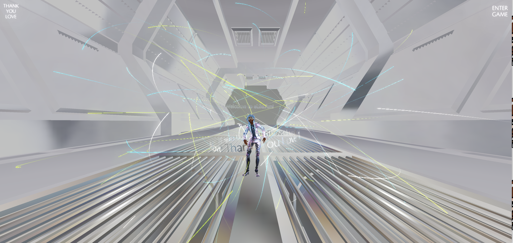

# 🧸 Visual Effect Use Case

<figure><figcaption>
<a href="https://www.agape.town/">https://www.agape.town/</a>
</figcaption></figure>

<figure><figcaption>
<a href="https://v1.capitalcode.co/beyond/explore">https://v1.capitalcode.co/beyond/explore</a>
</figcaption></figure>

<figure><figcaption>
<a href="https://www.elife.fun/landing">https://www.elife.fun/landing</a>
</figcaption></figure>

<figure><figcaption>
capital code art basal 2021: <a href="https://www.elife.fun/game?scene=capitalcodeABM2021lounge">https://www.elife.fun/game?scene=capitalcodeABM2021lounge</a>
</figcaption></figure>

<figure><figcaption>
<a href="https://metachicken.elife.fun/">https://metachicken.elife.fun/</a>
</figcaption></figure>

<figure><figcaption>
<a href="https://doggo-metaverse.vercel.app/place/lobby">https://doggo-metaverse.vercel.app/place/lobby</a>
</figcaption></figure>

<figure><figcaption>
<a href="https://doggo-metaverse.vercel.app/place/polling">https://doggo-metaverse.vercel.app/place/polling</a>
</figcaption></figure>

<figure><figcaption>
<a href="https://capitalcode.co/">https://capitalcode.co/</a>
</figcaption></figure>

<figure><figcaption>
<a href="https://v1.capitalcode.co/">https://v1.capitalcode.co/</a>
</figcaption></figure>

